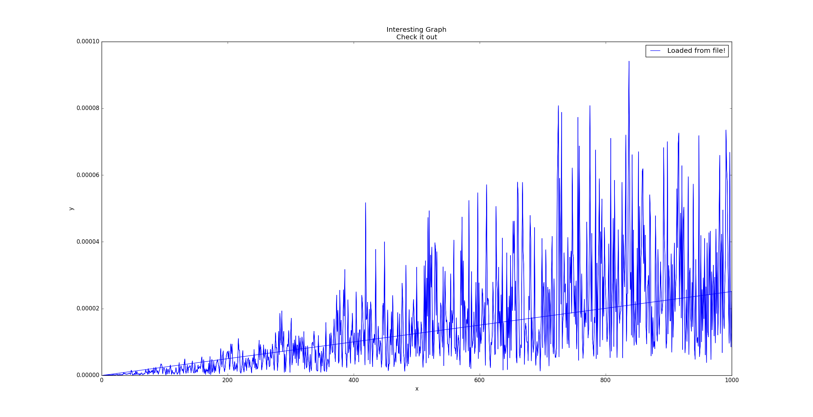
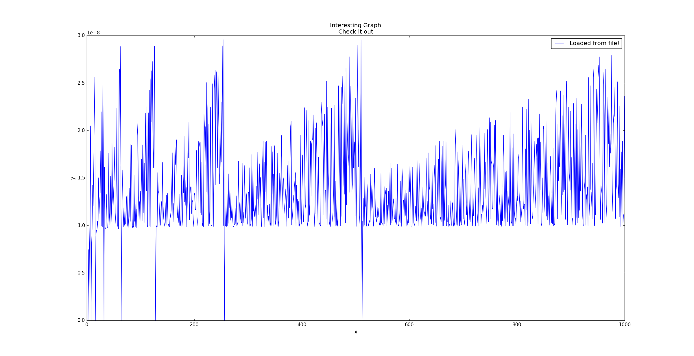

# Fortran1
Project was written using ifort compilator.


## Results
To generate results files just run bash script, it takes care of everything.
```
bash results.sh
```

### Kind 4


### Kind 8


### Kind 16

